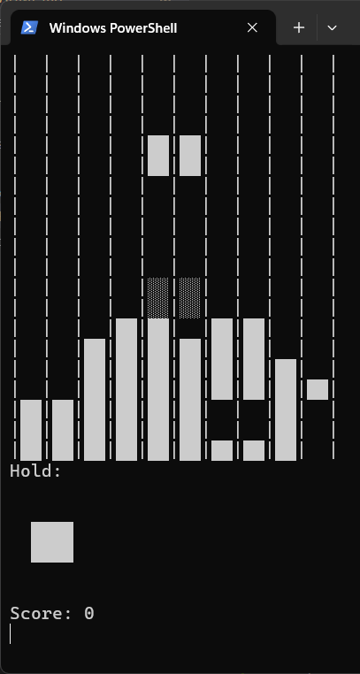

# Tetris-C

A Tetris clone written in C for Windows, playable in the terminal.



## Features

- Classic Tetris gameplay with 7 standard tetromino shapes
- Piece rotation, hard drop, and hold functionality
- Line clearing and scoring
- Ghost piece preview
- Simple ASCII/Unicode graphics

## Controls

| Key                        | Action       |
| -------------------------- | ------------ |
| Left/Right/Down Arrow Keys | Move piece   |
| Up Arrow Key               | Rotate Piece |
| Space                      | Hard drop    |
| C                          | Hold piece   |
| Q                          | Quit game    |

## Requirements

- Windows OS
- GCC (MinGW) or MSVC compiler

## Build & Run

To build the project, run:

```
gcc .\game.c  -o game
```

To run and start playing, run:

```
.\game.exe
```
